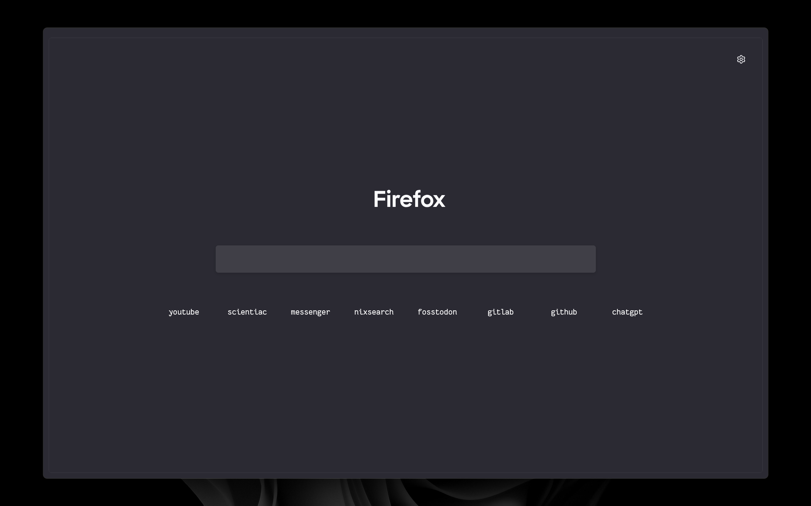
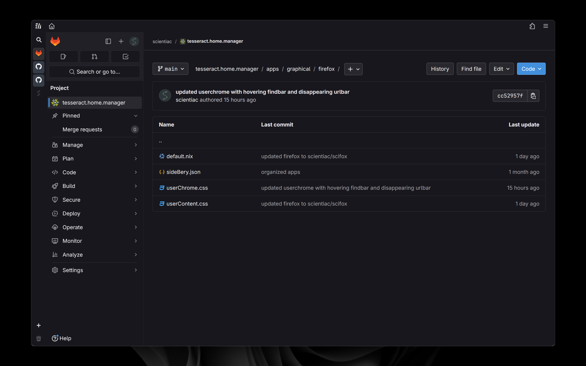
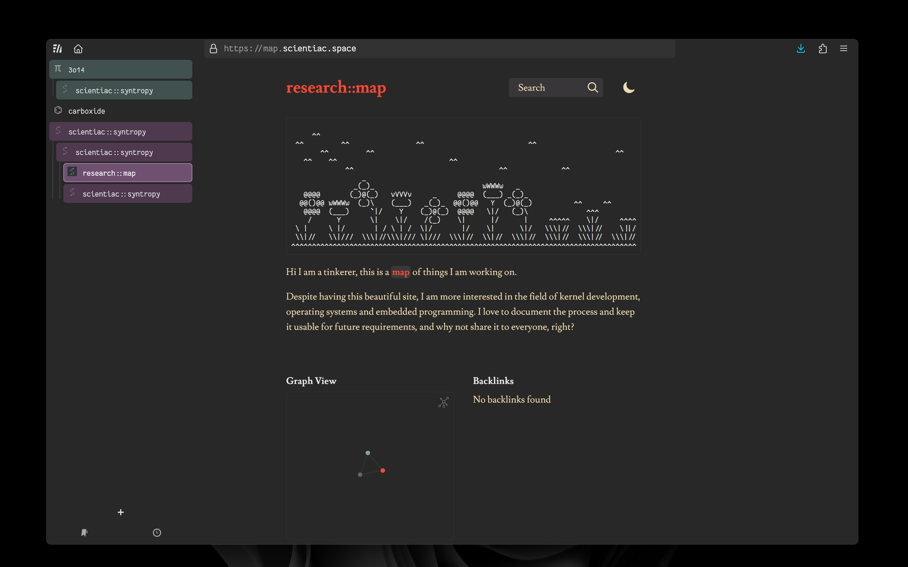
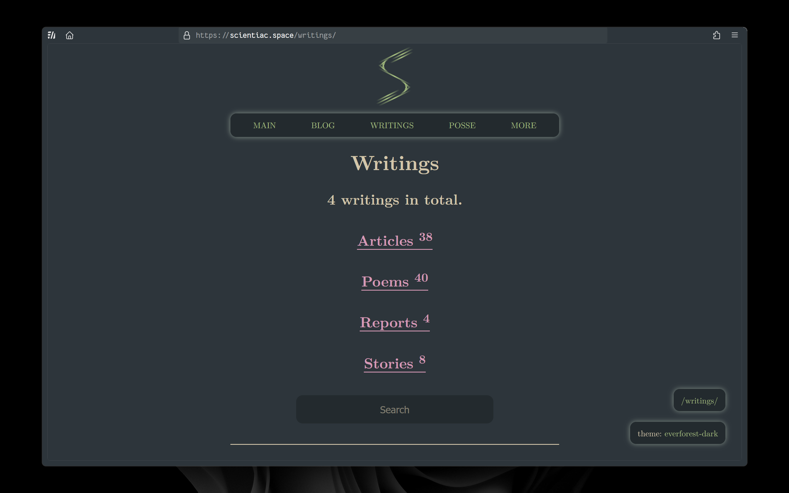

# ❄️ scifox
An Immersive Firefox userStyle

You can clone this branch by: `git clone -b immersive https://github.com/scientiac/scifox`

## Screenshots

#### Homepage

#### During Usage

#### Sidebar

#### Navbar

## ⚙️ Installation
1. In the searchbar type `about:config`. A dialog will be shown to you. Press the **I accept the risk** button.
2. Search for **`toolkit.legacyUserProfileCustomizations.stylesheets`**, **`layers.acceleration.force-enabled`**, **`gfx.webrender.all`**, and **`svg.context-properties.content.enabled`**. Change them to **True**

> Set `browser.newtabpage.activity-stream.improvesearch.handoffToAwesomebar` to **false** to use the homepage search bar without jumping to the url bar.
> Set `browser.startup.preXulSkeletonUI` to **false** to disable skeletonUI rendering during firefox launch.

3. Go to your Firefox profile:
    - If you're on Linux: `$HOME/.mozilla/firefox/XXXXXXX.default-release/`
    - If you're on Windows: `C:\Users\<USERNAME>\AppData\Roaming\Mozilla\Firefox\Profiles\XXXXXXX.default-XXXXXX`
    - If you're on MacOS: `Users/<USERNAME>/Library/Application Support/Firefox/Profiles/XXXXXXX.default-XXXXXXX`
4. Move the `chrome` folder into the directory.
5. Install the [sidebery](https://addons.mozilla.org/en-US/firefox/addon/sidebery/) addon and go to `sidebery settings > Help > Import addon data` then pick `sidebery.json` and apply everything.
6. Make all the customizations you want.
7. Enjoy!

### Setting your desired font
1. go to [about:config](about:config) and accept the risk.
2. Set `font.default.x-western` to `monospace`.
3. Set `font.name.monospace.x-western` to `<your desired font name>`

> You can get the name of the font you like from `settings > general > fonts` where you can see the name of the fonts in the dropdown, just copy the name of the font you like from there and paste it to the config stated by [3].

> I am using [FantasqueSansM Nerd Font](https://www.nerdfonts.com/font-downloads) in this configuration as my preferred font.

## 🚀 Usage

This userstyle has a keyboard centered usage:

-   `Alt` You can access to the global menu for an extended options you need
-   `Alt + Left Arrow` You can go Back
-   `Alt + Right Arrow` You can go Forward
-   `Ctrl + L` focuses the Navbar
-   `Ctrl + T` Opens a new Tab
-   `Ctrl + W` Closes a Tab
-   `Ctrl + Shift + T` Re-opens a tab that you just closed
-   `Ctrl + R` Refresh the page you're on
-   `Ctrl + Shift + A` Quick open for Add-Ons

### 🔧 Recommended settings

- Right click on toolbar -> Customize.
- Remove and Organize (as you want) all the removable elements including extensions, drag space and buttons.
- Install the [Adaptive Tab Bar Color](https://addons.mozilla.org/en-US/firefox/addon/adaptive-tab-bar-colour/) add on for a cleaner UI.

### Tips

- In `Settings > Search > Search Shortcuts` untick everything to get a minimal look in search suggestions.

## 🎉 Credit
* The simple design is heavily inspired by [simplefox](https://github.com/migueravila/SimpleFox). Additionally, this repository includes content reproduced or adapted from their userStyle.
* The single bar UI was inspired by [cascade](https://github.com/cascadefox/cascade).
* The sidebar UI is possible due to [sidebery](https://github.com/mbnuqw/sidebery).
